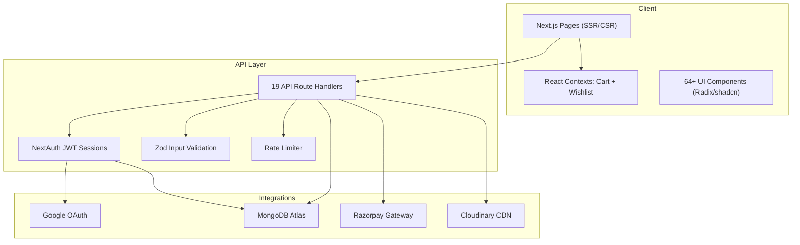
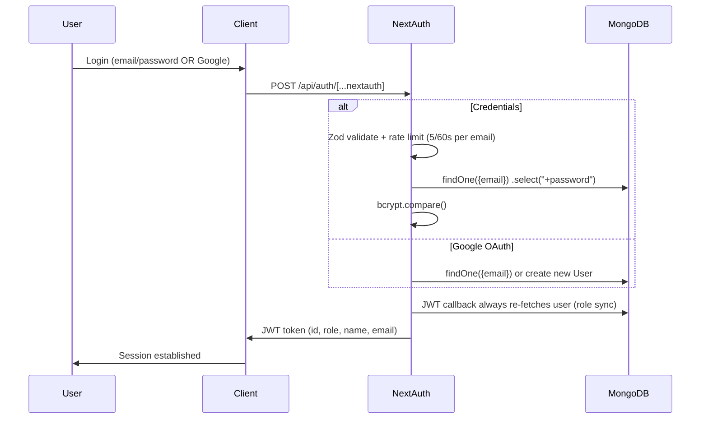
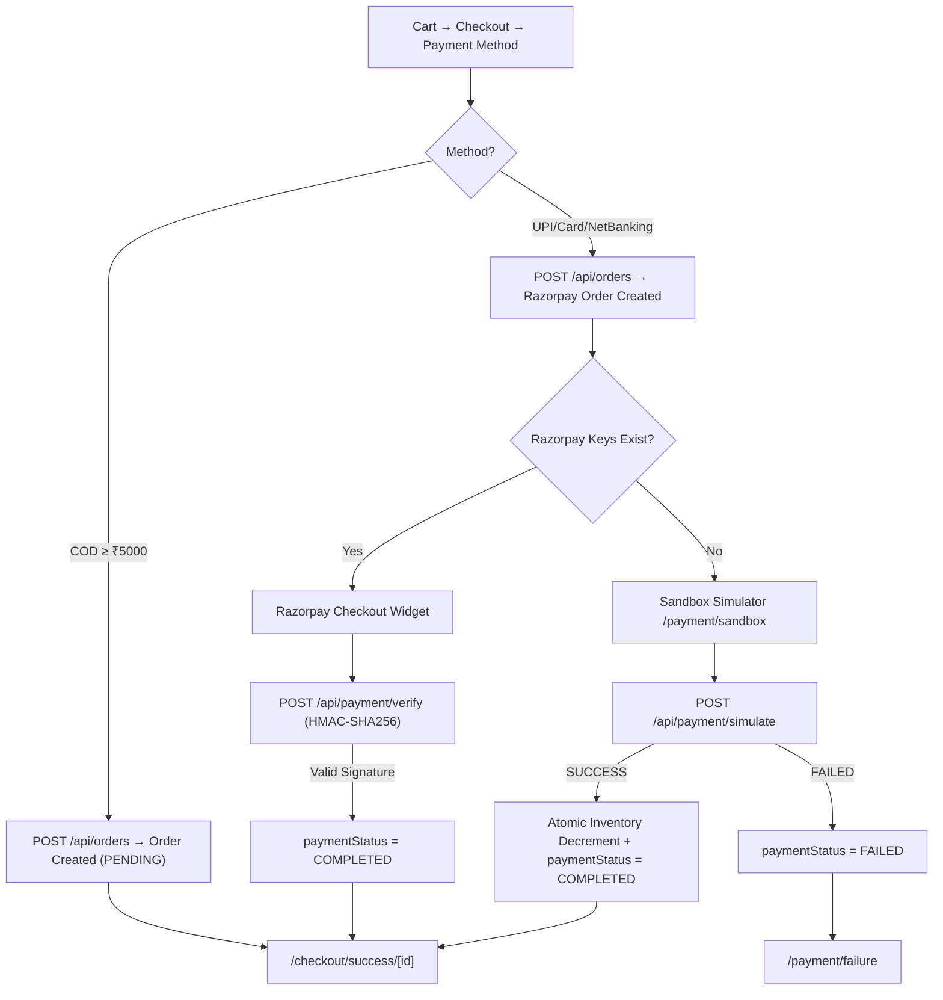

# Zestora — Full Project Summary

> **Zestora** is a production-grade, full-stack e-commerce platform for premium organic spices, built with **Next.js 15** (App Router + Turbopack), **MongoDB Atlas**, **NextAuth v4**, **Razorpay**, and **Cloudinary**.

---

## Tech Stack

| Layer | Technology |
|---|---|
| Framework | **Next.js 15** (App Router, Turbopack dev) |
| Language | TypeScript + some JS |
| Database | **MongoDB Atlas** via **Mongoose 9** |
| Auth | **NextAuth v4** — Google OAuth + Credentials (bcryptjs) |
| Payments | **Razorpay** (live + sandbox/simulate mode) |
| Image CDN | **Cloudinary** (upload via multer) |
| Validation | **Zod** (all API inputs) |
| UI Library | **Radix UI** primitives (64+ components), **shadcn/ui** pattern |
| Styling | **Tailwind CSS v4**, Google Fonts (Playfair Display, Inter) |
| Animations | **Framer Motion** |
| Charts | **Recharts** (admin dashboard) |
| Rate Limiting | `rate-limiter-flexible` (in-memory) |
| Misc | `date-fns`, `sonner` (toasts), `canvas-confetti`, `embla-carousel`, `react-hook-form` |

---

## Architecture Overview



---

## Database Models (Mongoose)

### 1. `User`
| Field | Type | Notes |
|---|---|---|
| `name` | String | Optional (Google auto-fills) |
| `email` | String | Unique, lowercase, regex-validated |
| `password` | String | `select: false`, bcrypt-hashed. Empty for Google users |
| `phone` | String | Optional |
| `addresses[]` | Subdoc | `{fullName, phone, street, city, state, postalCode, country}` |
| `image` | String | Google profile picture |
| `provider` | Enum | `credentials` \| `google` |
| `role` | Enum | `user` \| `admin` |

### 2. `Product`
| Field | Type | Notes |
|---|---|---|
| [id](file:///c:/Users/HP/Projects/Zestora/src/middleware.ts#10-36), `slug` | String | Both unique — [id](file:///c:/Users/HP/Projects/Zestora/src/middleware.ts#10-36) used for cart/order refs, `slug` for URL routes |
| `name`, `category`, `subCategory` | String | Category-based filtering |
| `price`, `originalPrice` | Number | `originalPrice` for strikethrough pricing |
| `weight`, `image`, `images[]` | String | Multiple images supported |
| `description`, `shortDescription`, `origin` | String | |
| `healthBenefits[]`, `tags[]` | [String] | Searchable arrays |
| `rating`, `reviewCount` | Number | |
| `inStock`, `featured`, `isNew`, `isBestseller` | Boolean | Product flags |
| `flavorProfile` | Subdoc | `{aroma, freshness, spiciness, notes[]}` — visual radar chart |
| `recipe` | Subdoc | `{name, ingredients[{name, quantity}]}` |
| `storageTips`, `grindingVideoUrl` | String | Educational content |
| `traceability` | Subdoc | `{batchNo, harvestDate, farmName}` |
| `cuisine[]`, `dietary[]` | [String] | Navigation filters |
| `subscribeAndSaveDiscount` | Number | |

### 3. `Order`
| Field | Type | Notes |
|---|---|---|
| `userId` | ObjectId → User | Required |
| `products[]` | Subdoc | `{productId, name, price, quantity, image}` — denormalized snapshot |
| `totalPrice` | Number | **Server-calculated** (prevents price tampering) |
| `paymentMethod` | Enum | `COD` \| `UPI` \| `CARD` \| `NETBANKING` |
| `paymentStatus` | Enum | `PENDING` \| `COMPLETED` \| `FAILED` |
| `orderStatus` | Enum | `Order Placed` → `Processing` → `Shipped` → `Out for Delivery` → `Delivered` / `Cancelled` |
| `deliveryAddress` | Subdoc | `{fullName, phone, addressLine, city, state, pincode}` |

### 4. `Inventory`
| Field | Type | Notes |
|---|---|---|
| `productId` | String (unique) | Maps to `Product.id` |
| `stock` | Number (min: 0) | Auto-seeded to 100 on first order if missing |

---

## Authentication Flow



**Key design decisions:**
- JWT strategy (no DB sessions) — the [jwt](file:///c:/Users/HP/Projects/Zestora/src/app/api/auth/%5B...nextauth%5D/route.ts#128-160) callback **always** queries MongoDB so role changes (e.g., promoting to admin) take effect immediately
- Login rate-limited: 5 attempts per email per 60s
- Signup rate-limited: 5 per IP per 60s
- Passwords hashed with `bcryptjs` (salt rounds: 10)
- Google users have no password field — credentials login blocked for them

---

## API Routes (19 endpoints)

### Auth
| Method | Route | Description |
|---|---|---|
| GET/POST | `/api/auth/[...nextauth]` | NextAuth handler (login, session, callbacks) |
| POST | `/api/auth/signup` | Registration — Zod validated, rate-limited, bcrypt |

### Products
| Method | Route | Description |
|---|---|---|
| GET | `/api/products` | List all. Query params: `category`, `featured`, `search`, `sort` (price-asc/desc, rating, newest, featured) |
| GET | `/api/products/[slug]` | Single product by slug |

### Orders
| Method | Route | Description |
|---|---|---|
| POST | `/api/orders` | **Place order** — auth required, Zod validated, rate-limited, server-side price recalculation, inventory check, auto-creates Razorpay order for prepaid |
| GET | `/api/orders/me` | User's own orders |
| GET | `/api/orders/me/[id]` | Single order detail (ownership verified) |
| POST | `/api/orders/me/[id]/cancel` | Cancel own order |

### Payments
| Method | Route | Description |
|---|---|---|
| POST | `/api/payment/verify` | **Razorpay signature verification** — HMAC-SHA256 validation, updates `paymentStatus` to `COMPLETED` |
| POST | `/api/payment/simulate` | **Sandbox mode** — simulates SUCCESS/FAILED. On success: atomic inventory decrement with rollback on stock failure |

### User
| Method | Route | Description |
|---|---|---|
| GET | `/api/user/profile` | Fetch own profile (password excluded) |
| PUT | `/api/user/profile` | Update name, phone, addresses — Zod `.strict()` prevents injection |
| GET | `/api/user/orders` | Alternative order listing endpoint |

### Admin (middleware-protected)
| Method | Route | Description |
|---|---|---|
| GET | `/api/admin/metrics` | Dashboard KPIs: totalOrders, totalUsers, totalRevenue, lowStockCount |
| GET | `/api/admin/stats` | Extended statistics |
| GET | `/api/admin/orders` | All orders (full list) |
| GET/PUT | `/api/admin/orders/[id]` | View/update single order |
| PUT | `/api/admin/orders/[id]/status` | Update order status |
| DELETE/PUT | `/api/admin/users/[id]` | Manage users |

### Upload
| Method | Route | Description |
|---|---|---|
| POST | `/api/upload` | Image upload → Cloudinary via multer (disk storage) |

### Seeding
| Method | Route | Description |
|---|---|---|
| POST/GET | `/api/seed` | DB seed route (bulk product import) |

---

## Frontend Pages (23 routes)

### Public Pages
| Route | Description |
|---|---|
| `/` | Homepage — hero, featured products, bento grid features, brand story |
| `/shop` | Product listing — category filters, search, sort, product cards |
| `/shop/[slug]` | Product detail — images, flavor visualizer, recipe, traceability |
| `/about` | Brand story page |
| `/contact` | Contact form |

### Auth Pages
| Route | Description |
|---|---|
| `/login` | Email/password + Google OAuth login |
| `/signup` | Registration form |
| `/forgot-password` | Password reset flow |

### Shopping Flow
| Route | Description |
|---|---|
| `/cart` | Full cart page (also has sidebar drawer via `CartSidebar` component) |
| `/wishlist` | Saved products (localStorage-backed) |
| `/checkout` | Address entry + shipping info |
| `/checkout/payment` | Payment method selection (COD/UPI/Card/NetBanking) |
| `/checkout/review` | Order review before placement |
| `/checkout/success/[id]` | Post-order confirmation page |

### Payment Sandbox
| Route | Description |
|---|---|
| `/payment/sandbox` | Simulated payment page (for testing without Razorpay keys) |
| `/payment/success` | Payment success landing |
| `/payment/failure` | Payment failure landing |

### User Account
| Route | Description |
|---|---|
| `/account` | Profile management (name, phone, addresses) |
| `/account/orders` | Order history list |
| `/account/orders/[id]` | Order detail with tracking timeline |

### Admin Dashboard
| Route | Description |
|---|---|
| `/admin/dashboard` | Metrics cards (revenue, orders, users, low stock) + charts |
| `/admin/orders` | All orders management — status updates |
| `/api/admin/add-product` | Product creation form (note: lives under `api/admin` as a page) |

---

## Middleware & Security

### Route Protection ([middleware.ts](file:///c:/Users/HP/Projects/Zestora/src/middleware.ts))
- **Matcher:** `/admin/:path*`
- Extracts JWT token via `getToken()`, queries MongoDB for user's current role
- Redirects non-admin users to `/` — **no client-side bypass possible**

### Security Headers ([next.config.ts](file:///c:/Users/HP/Projects/Zestora/next.config.ts))
All responses include:
- `X-XSS-Protection: 1; mode=block`
- `X-Frame-Options: SAMEORIGIN`
- `X-Content-Type-Options: nosniff`
- `Referrer-Policy: strict-origin-when-cross-origin`
- `Strict-Transport-Security: max-age=63072000; includeSubDomains; preload`
- `Permissions-Policy: camera=(), microphone=(), geolocation=()`

### API Security Measures
- **Zod validation** on every write endpoint (`.strict()` to reject unknown fields)
- **Rate limiting** — in-memory, 10 req/60s default, 5/60s on auth routes
- **Server-side price recalculation** — order API never trusts client-sent prices
- **Atomic inventory decrement** with rollback on failure
- **Password never returned** — `select: false` on User model
- **Role never accepted from frontend** — hardcoded to `"user"` on signup
- **Console stripping** in production via `compiler.removeConsole`
- **Ownership checks** on all user-specific endpoints (orders, profile)

---

## Client State Management

### [CartContext](file:///c:/Users/HP/Projects/Zestora/src/contexts/CartContext.tsx#74-86) (React Context + `useReducer`)
- **Persisted to `localStorage`** under key `zestora_cart`
- Hydrates on mount, syncs on every change
- Actions: `ADD_ITEM`, `REMOVE_ITEM`, `UPDATE_QUANTITY`, `CLEAR_CART`, `TOGGLE_CART`, `OPEN_CART`, `CLOSE_CART`
- Computed: `totalItems`, `totalPrice`

### [WishlistContext](file:///c:/Users/HP/Projects/Zestora/src/contexts/WishlistContext.tsx#8-15) (React Context + `useState`)
- **Persisted to `localStorage`** under key `zestora_wishlist`
- Actions: [addItem](file:///c:/Users/HP/Projects/Zestora/src/contexts/CartContext.tsx#119-120), [removeItem](file:///c:/Users/HP/Projects/Zestora/src/contexts/WishlistContext.tsx#46-49), [toggle](file:///c:/Users/HP/Projects/Zestora/src/contexts/WishlistContext.tsx#52-59), [isWishlisted](file:///c:/Users/HP/Projects/Zestora/src/contexts/WishlistContext.tsx#50-51)

### Provider Hierarchy (root [layout.tsx](file:///c:/Users/HP/Projects/Zestora/src/app/layout.tsx))
```
AuthProvider (NextAuth SessionProvider)
  └─ CartProvider
       └─ WishlistProvider
            └─ {children}
            └─ FloatingIslandNav
            └─ VisualEditsMessenger
            └─ AnalyticsWrapper
```

---

## Component Architecture

### Layout Components (`components/layout/`)
| Component | Purpose |
|---|---|
| `Navbar` | Main nav with search, cart badge, user menu |
| `Footer` | Site footer with links, social, newsletter |
| `FloatingIslandNav` | Mobile bottom navigation island |
| `CartSidebar` | Slide-out cart drawer |
| `SearchOverlay` | Full-screen search with live results |

### Custom UI Components (`components/ui/` — 64 files)
Key custom ones beyond shadcn primitives:
| Component | Purpose |
|---|---|
| `ProductCard` | Shop listing card (image, price, add-to-cart, wishlist toggle) |
| `CartItemCard` | Cart item with quantity selector and remove |
| `OrderSummary` | Checkout order summary panel |
| `StepIndicator` | Checkout multi-step progress indicator |
| `TrackingTimeline` | Order tracking status timeline |
| `FlavorVisualizer` | Radar/spider chart for spice flavor profiles |
| `BentoGridFeatures` | Homepage feature showcase in bento layout |
| `QuantitySelector` | +/- quantity control |
| `PrimaryButton` | Styled CTA button |
| `Logo` | Brand logo component |

---

## Custom Hooks

| Hook | Purpose |
|---|---|
| `use-mobile` | Responsive breakpoint detection |
| `useAnalytics` | Page view / event tracking wrapper |
| `useMagnetic` | Magnetic cursor effect for interactive elements |

---

## Environment Variables

| Variable | Service |
|---|---|
| `MONGODB_URI` | MongoDB Atlas connection string |
| `NEXTAUTH_SECRET` | JWT signing secret |
| `NEXTAUTH_URL` | Base URL (e.g., `http://localhost:3000`) |
| `GOOGLE_CLIENT_ID` | Google OAuth client ID |
| `GOOGLE_CLIENT_SECRET` | Google OAuth secret |
| `CLOUD_NAME` | Cloudinary cloud name |
| `API_KEY` | Cloudinary API key |
| `API_SECRET` | Cloudinary API secret |
| `RAZORPAY_KEY_ID` | Razorpay key (optional — sandbox mode if missing) |
| `RAZORPAY_KEY_SECRET` | Razorpay secret |

---

## Payment Flow



---

## SEO & Meta

- **Dynamic sitemap** ([sitemap.ts](file:///c:/Users/HP/Projects/Zestora/src/app/sitemap.ts)) fetches products from MongoDB
- **robots.ts** configured
- OpenGraph meta on root layout
- Semantic HTML throughout
- Proper heading hierarchy

---

## Notable Design Patterns

1. **Server-side price integrity** — The order API re-fetches product prices from DB, never trusting the client
2. **Inventory auto-seeding** — If no inventory record exists for a product on first order, it auto-creates with stock=100
3. **Atomic stock decrement with rollback** — The simulate endpoint decrements one-by-one and rolls back all if any item fails
4. **Idempotent payment processing** — Duplicate simulate/verify calls are rejected if order is already processed
5. **Case-insensitive email matching** — All email lookups use regex `^escaped$` with `"i"` flag
6. **Global Mongoose connection caching** — Prevents connection proliferation during dev hot reloads
